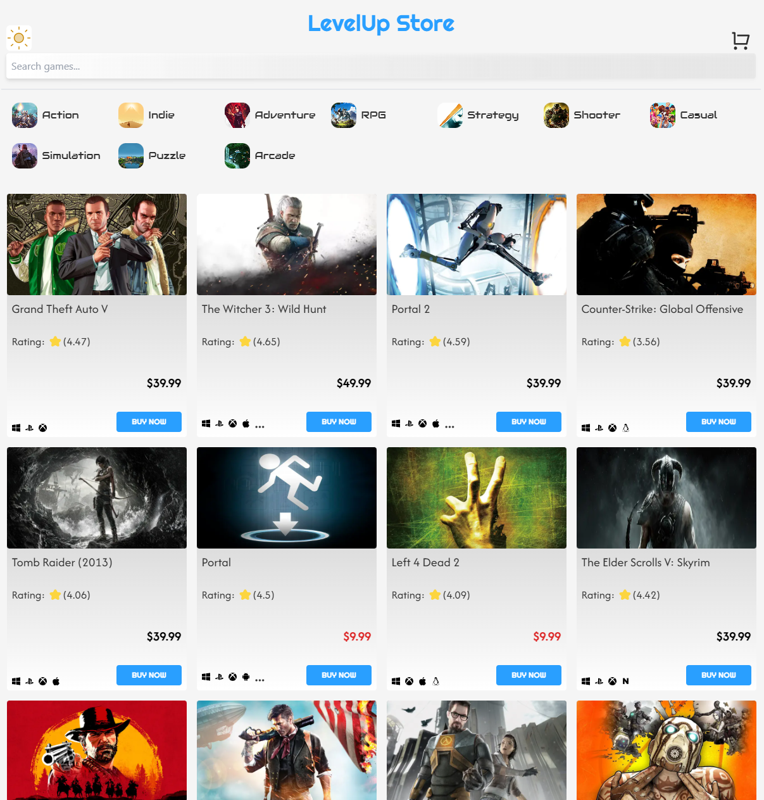
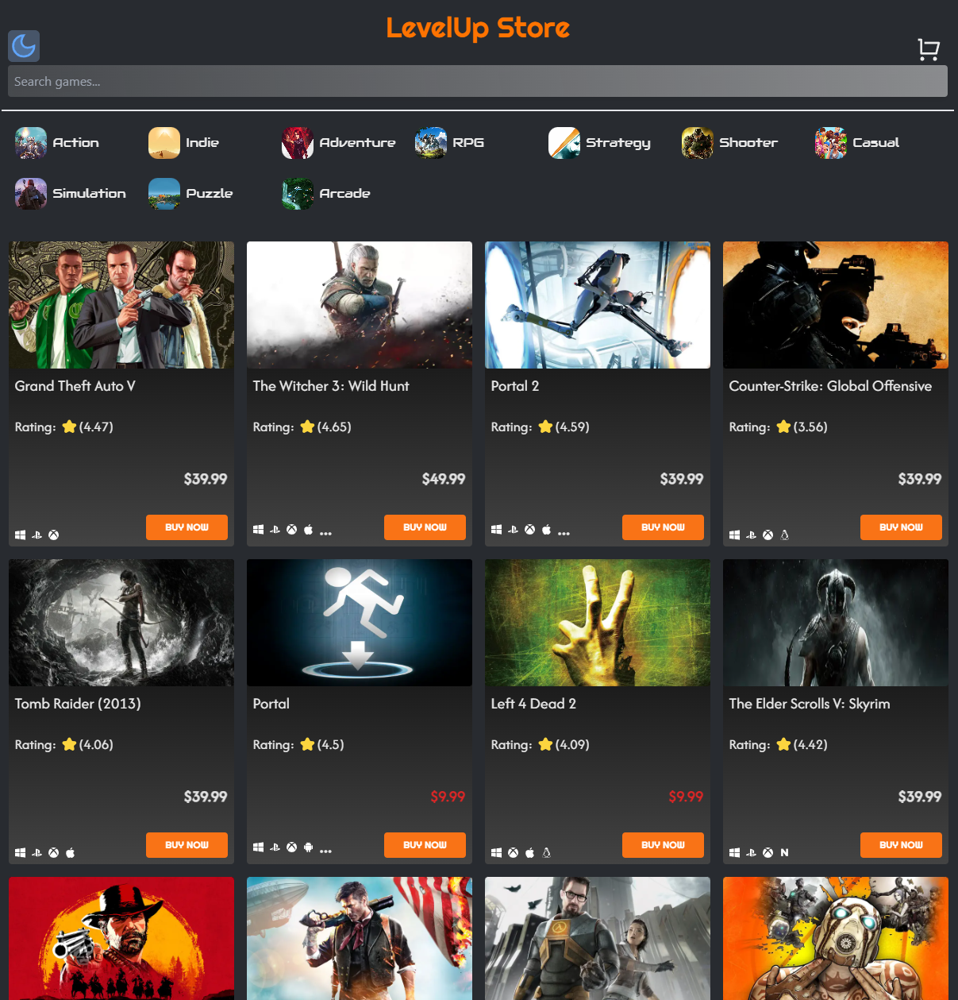

# 🎮 LevelUp Store

## [👉 Live Demo on Vercel](https://level-up-store-one.vercel.app/)

</br>

**LevelUp Store** is a modern e-commerce platform for discovering and purchasing video games.  
Built with **Next.js**, **Tailwind CSS**, and the **RAWG API**, it offers a smooth and stylish shopping experience with a fully functional cart, dark/light mode toggle, and animated checkout flow.

### 🧾 About This Project

This project was created to simulate a real online game store using modern frontend tools.

The user can:

- Browse and explore games
- Add them to the cart
- Go through a simple checkout (ZIP → BankID scan → confirmation)
- Receive an order confirmation with summary and order ID
- All cart data is stored in `localStorage` for persistence.

---

## What Can You Do?

- ✅ Browse video games by category (genre)
- ✅ Search for games with autocomplete
- ✅ Read game descriptions and view game details
- ✅ Add/remove items to/from your cart
- ✅ See dynamic prices based on game release year
- ✅ Go through a 3-step checkout process (ZIP → BankID scan → Confirmation)
- ✅ Dark/light mode with animated transitions
- ✅ Fully responsive design (mobile/tablet/desktop)

---

## Tech Stack

- **Next.js 15** – App Router & Server Actions
- **Tailwind CSS** – Utility-first styling
- **Jotai** – Lightweight state management (for cart)
- **RAWG API** – Video game data
- **Framer Motion** – SVG and UI animations
- **TypeScript** – Type-safe coding
- **LocalStorage** – Persistent cart handling

---

## Getting Started

### 1. Clone the project

```bash
git clone https://github.com/AdreanRodriguez/LevelUpStore.git
cd LevelUpStore

npm install
```

### 2. Create a `.env.local` file in the root

```env
NEXT_PUBLIC_BASE_URL="https://api.rawg.io/api"
NEXT_PUBLIC_RAWG_API_KEY="your_rawg_api_key"
```

- ### You can request a free API key at: [RAWG.io/apidocs](https://rawg.io/apidocs)

### 3. Run the development server locally

```bash
npm run dev
```

- Open your browser and go to: [http://localhost:3000](http://localhost:3000)

### Lightmode



### Darkmode



## Made with ❤️ by Adrean Rodriguez
